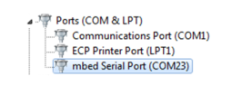
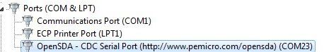

# Connecting to the Kinetis platform

The flashloader supports UART and USB connections to a computer. See the Reference Manual for a specific device to determine the peripherals supported by the flashloader application and the signals route to the pins of the Kinetis platform. After the Kinetis platform is powered up, there is a physical serial/USB connection between the Kinetis platform and host. The Kinetis device is ready to receive commands.

For this example, a Kinetis device is connected to a serial-to-USB converter that enumerates on a Windows® operating systems PC as a Serial Port on COMx.

**UART connection to MCU platform** 

**Alternate UART connection to MCU platform**

