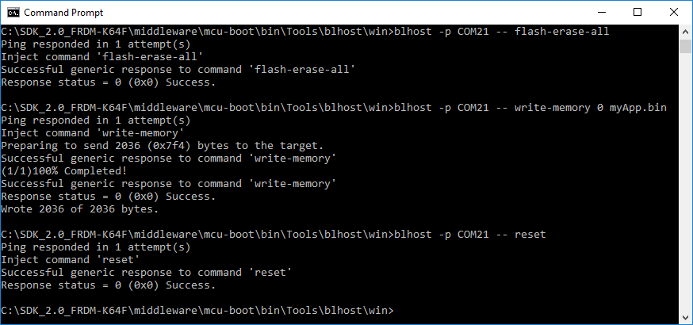

# Flashing the user application

The flashloader issue two commands to program the Kinetis flash memory with a user application once the communication establishes between the flashloader and the host.

-   *blhost -p COMx -- flash-erase-all* - Erases the entire flash array.
-   *blhost -p COMx -- write-memory 0 myApp.bin* – Writes the myApp.bin binary image to address 0 of the Kinetis flash memory.
-   \[Optional\] *blhost -p COMx -- reset* – Resets the Kinetis platform and launches the user application. Note: the flashloader is no longer running on the device, so further commands issued from the blhost utility fail.
-   After issuing the reset command, allow 5 seconds for the user application to start running.
-   Below screenshot shows the successful completion of the above commands.

**Programming a user application using the MCU flashloader**

