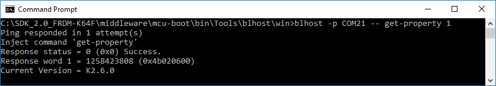

# Host utility application - blhost

This section describes how blhost host utility program is used to communicate with the MCU bootloader.

-   Open a command prompt in the directory containing blhost.
-   Type *blhost --help* to see the complete usage of the blhost utility.

Verify if the Kinetis device is connected and is running the flashloader firmware application.

-   Assumption: The Kinetis platform just came out of reset.
-   Check under the COM port in Device Manager that the Kinetis platform is connected. In this example, let us say that the device is connected to COMx.
-   Type *blhost -p COMx -- get-property 1* to get the flashloader version from the flashloader.
-   Below screenshot shows that blhost is successfully communicating with the Kinetis platform.

**Host communication with MCU flashloader**

