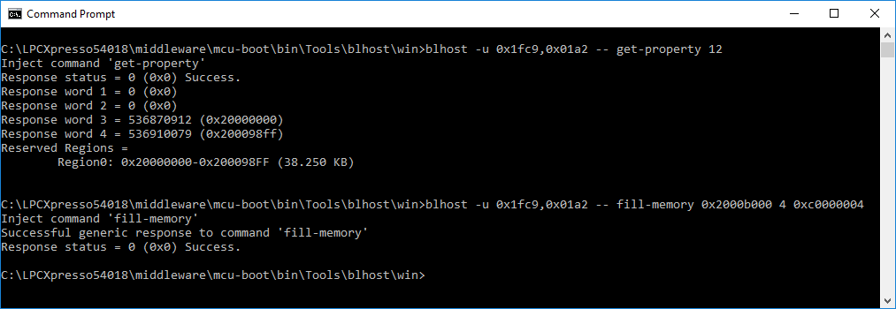
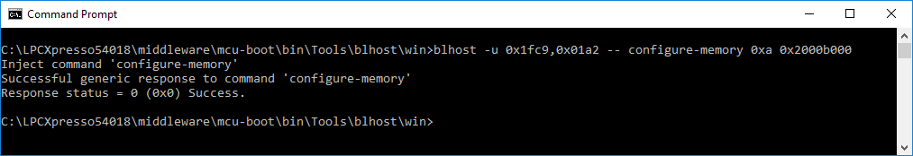
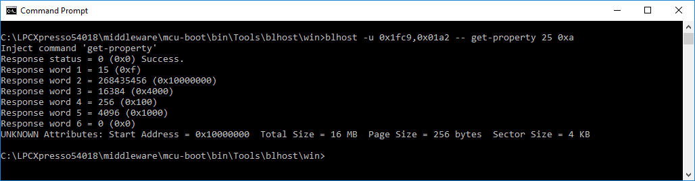

# Configuring external Quad SPI flash

Before accessing the Quad SPI flash memory, the SPIFI peripheral interface needs to be configured to the correct type of external Quad SPI flash present on the device. The flashloader command configure-memory is used for configuring, initializing, and preparing the SPIFI peripheral interface. The blhost application can be used to send the configure-memory command. The command require two arguments, memory-id and address-of-spi-nor-config-option-block. The memory-id for Quad SPI flash is 0xA. The address should point to the appropriate SRAM location where the configuration options block data is written prior to calling the configure-memory command. The bootloader commands, write-memory/fill-memory can be used to set the configuration data for the Quad SPI at the SRAM address. The following image shows the fill-memory command being used to fill the 4 bytes at address 0x2000b000 with configuration data 0xc0000004.

**Note:** The configuration block for Quad SPI flash memory should be programmed to SRAM other than reserved region.

The configuration structure is described in Chapter [QuadSPI configuration structure](spifi_configuration_structure.md).

**Fill-memory command**

The following example shows the call to configure-memory command:

**Call configure-memory command**

Once the QSPI is successfully configured, the Quad SPI memory can then be access for further operations to erase, read, write, and so on.

Bootloader uses its get-property command to read the external memory attributes for the configured QSPI memory. The following image shows the response for QSPI memory available on the LPC540xx/LPC54S0xx platform. The command requires two arguments, the property ID, 25, to read external memory attributes and memory ID, and 0xA, for external Quad SPI memory devices.

**Response for QSPI memory**

