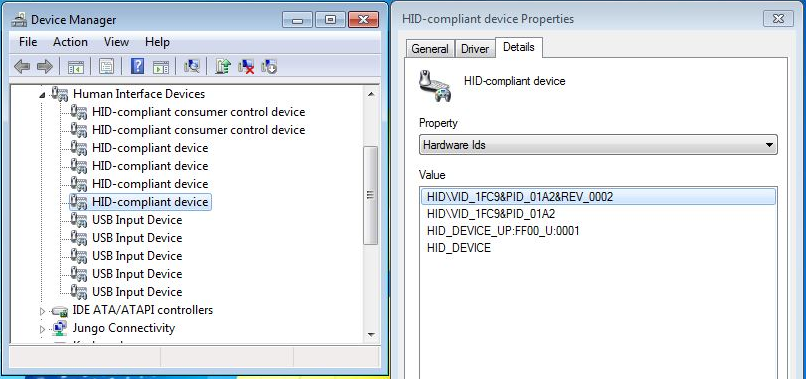

# Device running flashloader

The flashloader will be ready to receive the commands once

-   the flashloader binary is downloaded on the device connected in USB DFU mode
-   starts its execution on the LPC540xx/LPC54S0xx platform
-   a physical USB connection is estabilished between the device platform and host

For this example, we have an LPC540xx/LPC54S0xx device running flashloader.bin connected over USB that enumerates on a Windows PC as a HID compliant device.

**USB connection to LPC540xx/LPC54S0xx platform running flashloader application**



```{include} ../topics/testing_flashloader_execution_using_blhost.md
:heading-offset: 1
```

```{include} ../topics/flashing_the_user_application.md
:heading-offset: 1
```

