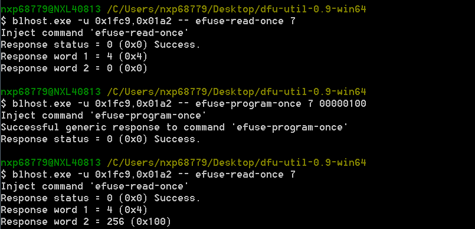

# efuse-program-once

The efuse-program-once command requires two arguments. The first is an index to one of 0 to 15 fuse words, and the second argument is the 32-bit data to program to the fuse word specified in the first argument. For LPC540xx devices, the first memory bank \(OTP Bank 0\) is reserved. The other three OTP banks are programmable. So, index 0, 1, 2,and 3 are invalid. See Chapter 46.12, OTP functional details in [UM11060 LPC540xx/LPC54S0xx User's Manual](https://www.nxp.com/docs/en/user-guide/UM11060.pdf) to see OTP functional details. The following example shows the blhost calling to program bit 0 of OTP Bank 1 Word 3.

`blhost.exe -u 0x1fc9,0x01a2 – efuse-program-once 7 00000001`

**efuse-program-once command results**

**Note:** The second argument should be in hex without the prefix “0x” to the 32-bit hex word.

