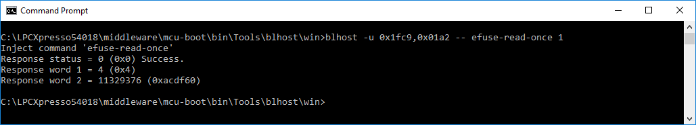

# efuse-read-once

The efuse-read-once command requires one argument, an index to one of 0 to 15 32-bit fuse words.

index 0: OTP Bank 0 Word 0

index 1: OTP Bank 0 Word 1

index 2: OTP Bank 0 Word 2

index 3: OTP Bank 0 Word 3

index 4: OTP Bank 1 Word 0

index 5: OTP Bank 1 Word 1

index 6: OTP Bank 1 Word 2

index 7: OTP Bank 1 Word 3

index 8: OTP Bank 2 Word 0

index 9: OTP Bank 2 Word 1

index 10: OTP Bank 2 Word 2

index 11: OTP Bank 2 Word 3

index 12: OTP Bank 3 Word 0

index 13: OTP Bank 3 Word 1

index 14: OTP Bank 3 Word 2

index 15: OTP Bank 3 Word 3

The index can be obtained by calculating 4 \* OTP\_Bank\_Index + Word\_Index. The following figure shows the results from fuse-read-once command for OTP Bank 0 Word 1.

**efuse-read-once command results OTP Bank 0 Word 1**

