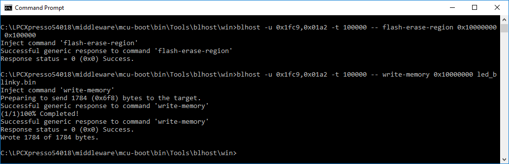
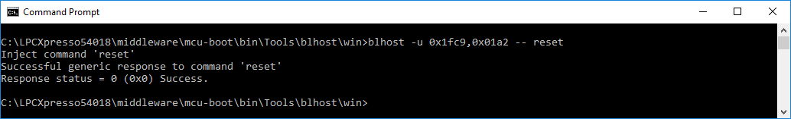

# Programming application to Quad SPI memory

As already stated, once the Quad SPI is configured using the configure-memory command, the external memory becomes accessible. The flash area must be first erased before programming the demo application image. The following examples show the external flash memory region being erased using the flash-erase-region command and write-memory command being used to program the application image on the erased region.

**External flash memory erased**

The application used in the above example is a simple LED blinking example \(led\_blinky.bin\) from the MCUXpresso SDK package. The application begins executing on the next boot or reset. The bootloader command `-- reset` can also be used to reset the device to boot and execute the led blinking application from the Quad SPI memory.

**Reset command**

**Note:** For a description of each bootloader command, see the *blhost User's Guide* \.

