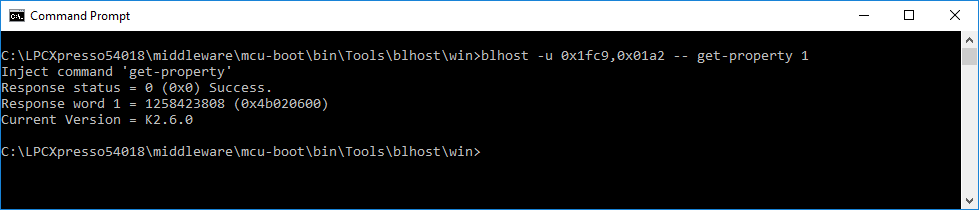

# Testing flashloader execution using blhost

This section describes a simple usage of the blhost host utility program to demonstrate communication with the LPC540xx/LPC54S0xx flashloader.

-   Open a command prompt in the directory containing blhost. For Windows OS, it is `<sdk_package>/middleware/mcu-boot/bin/Tools/blhost/win`.
-   Type `blhost --help` to see the complete usage of the blhost utility.

For this step, verify that the device is properly connected and is running the flashloader firmware application.

-   Note the USB vendor and product identifiers \(VID and PID\) of the device as shown in the above screenshot. The VID and PID are provided to identify the device with blhost when sending commands to the device.
-   Type `blhost -u 0x1fc9,0x01a2 -- get-property 1` to get the bootloader version from the flashloader application.
-   The below screenshot indicates that blhost.exe is successfully communicating with the flashloader.

**Host communication with ROM bootloader**

