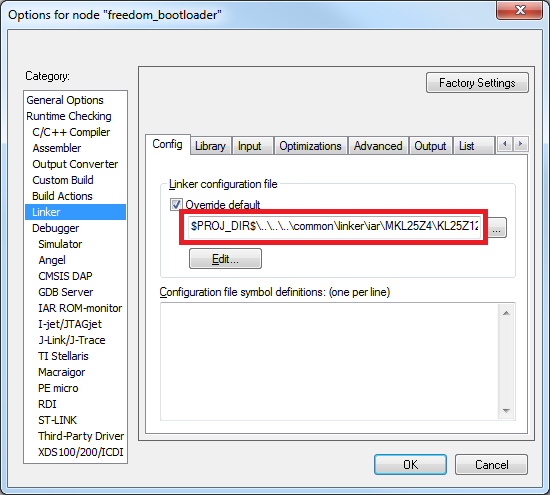

# Bootloader peripherals

The bootloader source uses a C/C++ preprocessor define to configure the bootloader based on the target device. Update this define to reference the correct set of device-specific header files.

**Options for node "freedom_bootloader"**


If the memory configuration of the target device differs from the closest match, the linker file must be replaced. Refer to linker files in devices/<device\>/<tool chain\> and update it as per the bootloader project. Update the linker settings via the project options.

**Porting guide change linker file**



```{include} ../topics/supported_peripherals.md
:heading-offset: 3
```

```{include} ../topics/peripheral_initialization.md
:heading-offset: 3
```

```{include} ../topics/clock_initialization.md
:heading-offset: 3
```

**Parent topic:**[Primary porting tasks](../topics/primary_porting_tasks.md)

