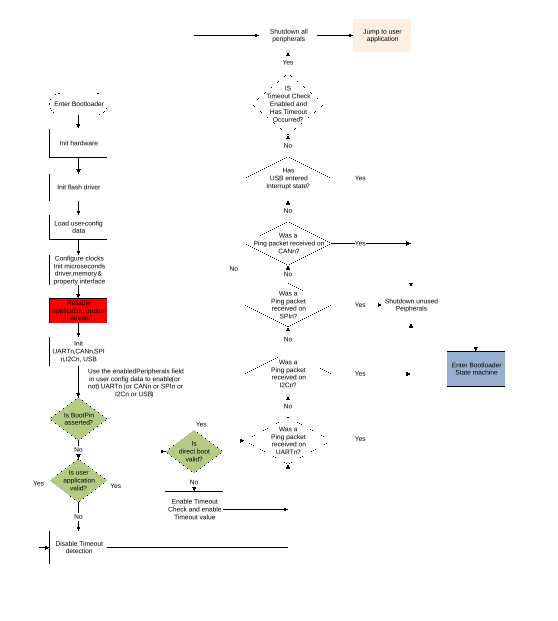

# Bootloader workflow with reliable update

There are two methods to initiate reliable update process. The first method is to reset the device to enter the bootloader startup process, causing MCU bootloader to detect the presence of a valid image in the backup region, and kicking off the reliable update process. The second method is by issuing a reliable-update command from host using BLHOST.exe while the bootloader is running on the device.

Using the first method, the reliable update process starts before all interfaces are configured. The figure below shows the call to reliable update process during startup flow of the MCU bootloader.

The second method occurs while the bootloader state machine is running. The reliable update process is triggered when the host sends the reliable update bootloader command.

**Bootloader workflow with reliable update**
|

|

**Parent topic:**[Functional description](../topics/functional_description_001.md)

