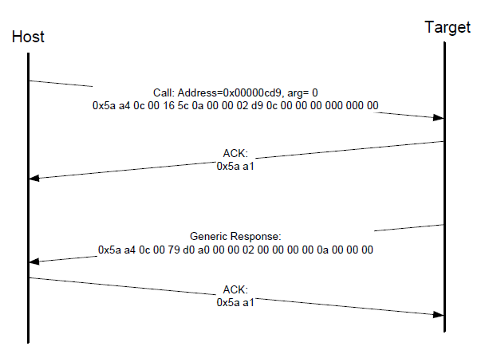

# Call command

The Call command executes a function that is written in the memory at the address sent in the command. The address must be be a valid memory location residing in the accessible flash \(internal or external\) or in the RAM. The command supports the passing of one 32-bit argument. Although the command supports a stack address, at this time, the call still takes place using the current stack pointer. After the execution of the function, a 32-bit return value is returned in the generic response message.

The QSPI must be initialized before executing the Call command if the call address is on the QSPI. The Call command does not initialize the QSPI.

**Protocol sequence for call command**

**Parameters for Call Command**
|Byte \#|Command|
|:-----:|-------|
|0 - 3|Call address|
|4 - 7|Argument word|
|8 - 11|Stack pointer|

**Response:** The target returns a GenericResponse packet with a status code either set to the return value of the function called or set to kStatus\_InvalidArgument \(105\).

**Parent topic:**[MCU bootloader command API](../topics/mcu_bootloader_command_api.md)

