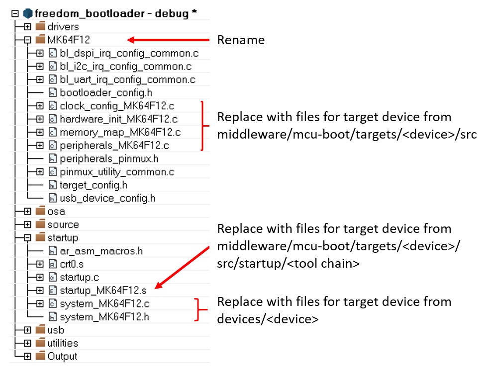
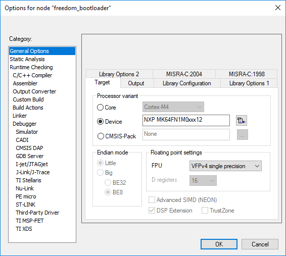

# Clean up the IAR project

This example uses the IAR tool chain for the new project. Other supported tool chains can be used in a similar manner.

MCU Bootloader projects can be found in <boards\>/board/bootloader\_examples. Open a bootloader project of the most similar device. This image shows an example of what a workspace looks like and the files that need to be touched.

**IAR workspace**

Once changes have been made, update the project to reference the target device. This can be found in the project options.

**Project options**
|

|

**Parent topic:**[Preliminary porting tasks](../topics/preliminary_porting_tasks.md)

