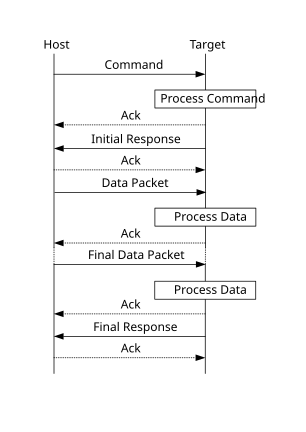

# Command with incoming data phase

The protocol for a command with incoming data phase contains:

-   Command packet \(from host\)\(kCommandFlag\_HasDataPhase set\)
-   Generic response command packet \(to host\)
-   Incoming data packets \(from host\)
-   Generic response command packet \(to host\)

**Command with incoming data phase**

**Note:**

-   The host may not send any further packets while it is waiting for the response to a command.
-   The data phase is aborted if, prior to the start of the data phase, the Generic Response packet does not have a status of kStatus\_Success.
-   Data phases may be aborted by the receiving side by sending the final Generic Response early with a status of kStatus\_AbortDataPhase. The host may abort the data phase early by sending a zero-length data packet.
-   The final Generic Response packet sent after the data phase includes the status for the entire operation.

**Parent topic:**[MCU bootloader protocol](../topics/mcu_bootloader_protocol.md)

