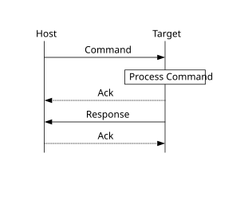

# Command with no data phase

**Note:** In these diagrams, the Ack sent in response to a Command or Data packet can arrive at any time before, during, or after the Command/Data packet has processed.

**Command with no data phase**

The protocol for a command with no data phase contains:

-   Command packet \(from host\)
-   Generic response command packet \(to host\)

**Command with no data phase**

**Parent topic:**[MCU bootloader protocol](../topics/mcu_bootloader_protocol.md)

