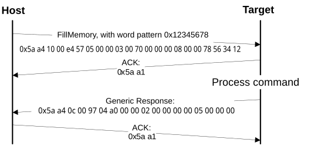

# FillMemory command

The FillMemory command fills a range of bytes in the memory with a data pattern. It follows the same rules as the WriteMemory command. The difference between the FillMemory and the WriteMemory is that a data pattern is included in the FillMemory command parameter, and there is no data phase for the FillMemory command, while the WriteMemory command has a data phase.

**Parameters for FillMemory Command**
| Byte # | Command |
| --- | --- |
| 0 - 3 | Start address of memory to fill |
| 4 - 7 | Number of bytes to write with the pattern •     The start address should be 32-bit aligned. •     The number of bytes must be evenly divisible by 4. (Note: for a partthat uses FTFE flash, the start address should be 64-bit aligned, and the number of bytes must be evenly divisible by 8). |
| 8 - 11 | 32-bit pattern |

-   To fill with a byte pattern \(8-bit\), the byte must be replicated four times in the 32-bit pattern.
-   To fill with a short pattern \(16-bit\), the short value must be replicated two times in the 32-bit pattern.

For example, to fill a byte value with 0xFE, the word pattern is 0xFEFEFEFE; to fill a short value 0x5AFE, the word pattern is 0x5AFE5AFE.

Special care must be taken when writing to the flash.

-   First, any flash sector written to must be previously erased with a FlashEraseAll, FlashEraseRegion, or FlashEraseAllUnsecure command.
-   First, any flash sector written to must be previously erased with a FlashEraseAll or FlashEraseRegion command.
-   Writing to the flash requires the start address to be 4-byte aligned \(\[1:0\] = 00\).
-   If the VerifyWrites property is set to true, then a write to the flash also performs a flash verify program operation.

When writing to the RAM, the start address does not need to be aligned, and the data is not padded.

**Protocol Sequence for FillMemory Command**

**FillMemory Command Packet Format (Example)**
|FillMemory|Parameter|Value|
|:--------:|:--------|:----|
|Framing packet|start byte|0x5A|
||packetType|0xA4, kFramingPacketType\_Command|
||length|0x10 0x00|
||crc16|0xE4 0x57|
|Command packet|commandTag|0x05 – FillMemory|
||flags|0x00|
||Reserved|0x00|
||parameterCount|0x03|
||startAddress|0x00007000|
||byteCount|0x00000800|
||patternWord|0x12345678|

The FillMemory command has no data phase.

**Response:** upon a successful execution of the command, the target \(MCU bootloader\) returns a GenericResponse packet with a status code set to kStatus\_Success, or to an appropriate error status code.

**Parent topic:**[MCU bootloader command API](../topics/mcu_bootloader_command_api.md)

