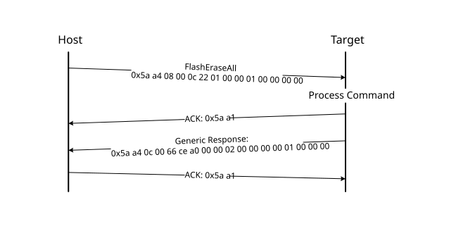

# FlashEraseAll command

The FlashEraseAll command performs an erase of the entire flash memory. If any flash regions are protected, then the FlashEraseAll command fails and returns an error status code. Executing the FlashEraseAll command releases the flash security. The flash security is enabled by setting the FTFA\_FSEC register. However, the FSEC field of the flash configuration field is erased, so unless it is reprogrammed, the flash security is re-enabled after the next system reset. The Command tag for the FlashEraseAll command is 0x01, set in the commandTag field of the command packet.

The FlashEraseAll command requires memory ID. If the memory ID is not specified, the internal flash \(memory ID =0\) is selected as default.

**Protocol Sequence for FlashEraseAll Command**

**FlashEraseAll Command Packet Format (Example)**
|FlashEraseAll|Parameter|Value|
|:-----------:|:--------|:----|
|Framing packet|start byte|0x5A|
||packetType|0xA4, kFramingPacketType\_Command|
||length|0x08 0x00|
||crc16|0x0C 0x22|
|Command packet|commandTag|0x01 - FlashEraseAll|
||flags|0x00|
||reserved|0x00|
||parameterCount|0x01|
||Memory ID|0x00000000 - Internal Flash \( 0x00000001 - QSPI0 Memory\)|

The FlashEraseAll command has no data phase.

**Response:** The target returns a GenericResponse packet with the status code set to kStatus\_Success for a successful execution of the command, or set to an appropriate error status code.

**Parent topic:**[MCU bootloader command API](../topics/mcu_bootloader_command_api.md)

