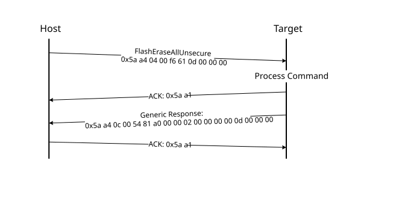

# FlashEraseAllUnsecure command

The FlashEraseAllUnsecure command performs a mass erase of the flash memory, including the protected sectors. The flash security is immediately disabled if it \(flash security\) was enabled, and the FSEC byte in the flash configuration field at address 0x40C is programmed to 0xFE. However, if the mass erase enable option in the FSEC field is disabled, then the FlashEraseAllUnsecure command fails.

The FlashEraseAllUnsecure command requires no parameters.

**Protocol Sequence for FlashEraseAllUnsecure Command**

**FlashEraseAllUnsecure Command Packet Format (Example)**
|FlashEraseAllUnsecure|Parameter|Value|
|:-------------------:|:--------|:----|
|Framing packet|start byte|0x5A|
||packetType|0xA4, kFramingPacketType\_Command|
||length|0x04 0x00|
||crc16|0xF6 0x61|
|Command packet|commandTag|0x0D - FlashEraseAllUnsecure|
||flags|0x00|
||reserved|0x00|
||parameterCount|0x00|

The FlashEraseAllUnsecure command has no data phase.

**Response:** The target returns a GenericResponse packet with the status code either set to kStatus\_Success for successful execution of the commandor set to an appropriate error status code.

**Note:** When the MEEN bit in the NVM FSEC register is cleared to disable the mass erase, the FlashEraseAllUnsecure command fails. FlashEraseRegion can be used instead, skipping the protected regions.

**Parent topic:**[MCU bootloader command API](../topics/mcu_bootloader_command_api.md)

