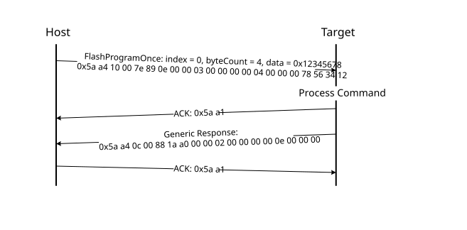

# FlashProgramOnce command

The FlashProgramOnce command writes the data \(that is provided in a command packet\) to a specified range of bytes in the program once field. Special care must be taken when writing to the program once field.

-   The program once field only supports programming once, so any attempts to reprogram a program once field get an error response.
-   Writing to the program once field requires the byte count to be 4-byte aligned or 8-byte aligned.

The FlashProgramOnce command uses three parameters: index 2, byteCount, data.

**Parameters for FlashProgramOnce Command**
|Byte \#|Command|
|:-----:|-------|
|0 - 3|Index of program once field|
|4 - 7|Byte count \(must be evenly divisible by 4\)|
|8 - 11|Data|
|12 - 16|Data|

**Protocol Sequence for FlashProgramOnce Command**

**FlashProgramOnce Command Packet Format (Example)**
|FlashProgramOnce|Parameter|Value|
|:--------------:|:--------|:----|
|Framing packet|start byte|0x5A|
||packetType|0xA4, kFramingPacketType\_Command|
||length|0x10 0x00|
||crc16|0x7E4 0x89|
|Command packet|commandTag|0x0E – FlashProgramOnce|
||flags|0|
||reserved|0|
||parameterCount|3|
||index|0x0000\_0000|
||byteCount|0x0000\_0004|
||data|0x1234\_5678|

**Response:** upon a successful execution of the command, the target \(MCU bootloader\) returns a GenericResponse packet with a status code set to kStatus\_Success, or to an appropriate error status code.

**Parent topic:**[MCU bootloader command API](../topics/mcu_bootloader_command_api.md)

