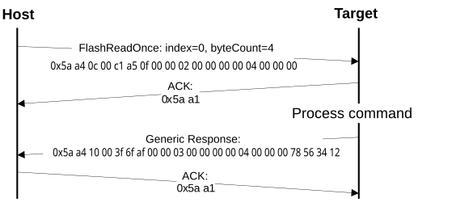

# FlashReadOnce command

The FlashReadOnce command returns the contents of the program once field by the given index and byte count. The FlashReadOnce command uses two parameters: index and byteCount.

**Parameters for FlashReadOnce Command**
|Byte \#|Parameter|Description|
|:-----:|---------|-----------|
|0 - 3|index|Index of the program once field \(to read from\)|
|4 - 7|byteCount|Number of bytes to read and return to the caller|

**Protocol Sequence for FlashReadOnce Command**

**FlashReadOnce Command Packet Format (Example)**
|FlashReadOnce|Parameter|Value|
|:-----------:|:--------|:----|
|Framing packet|start byte|0x5A|
||packetType|0xA4|
||length|0x0C 0x00|
||crc|0xC1 0xA5|
|Command packet|commandTag|0x0F – FlashReadOnce|
||flags|0x00|
||reserved|0x00|
||parameterCount|0x02|
||index|0x0000\_0000|
||byteCount|0x0000\_0004|

**FlashReadOnce Response Format (Example)**
|FlashReadOnce Response|Parameter|Value|
|:--------------------:|:--------|:----|
|Framing packet|start byte|0x5A|
||packetType|0xA4|
||length|0x10 0x00|
||crc|0x3F 0x6F|
|Command packet|commandTag|0xAF|
||flags|0x00|
||reserved|0x00|
||parameterCount|0x03|
||status|0x0000\_0000|
||byteCount|0x0000\_0004|
||data|0x1234\_5678|

**Response:** upon a successful execution of the command, the target returns a FlashReadOnceResponse packet with a status code set to kStatus\_Success, a byte count and corresponding data read from the Program Once Field upon a successful execution of the command, or a status code set to an appropriate error status code and a byte count set to 0.

**Parent topic:**[MCU bootloader command API](../topics/mcu_bootloader_command_api.md)

