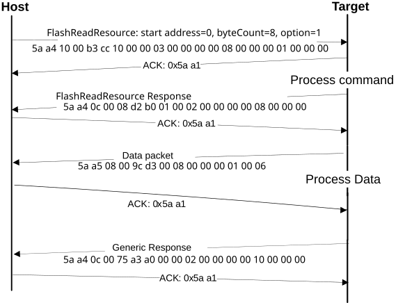

# FlashReadResource command

The FlashReadResource command returns the contents of the IFR field or the Flash firmware ID by the given offset, byte count, and option. The FlashReadResource command uses three parameters: start address, byteCount, and option.

**Parameters for FlashReadResource Command**
|Byte \#|Parameter|Command|
|:-----:|---------|-------|
|0 - 3|start address|Start address of specific non-volatile memory to be read|
|4 - 7|byteCount|Byte count to be read|
|8 - 11|option|0: IFR 1: Flash firmware ID|

**Protocol Sequence for FlashReadResource Command**

**FlashReadResource Command Packet Format (Example)**
|FlashReadResource|Parameter|Value|
|:---------------:|:--------|:----|
|Framing packet|start byte|0x5A|
||packetType|0xA4|
||length|0x10 0x00|
||crc|0xB3 0xCC|
|Command packet|commandTag|0x10 – FlashReadResource|
||flags|0x00|
||reserved|0x00|
||parameterCount|0x03|
||startAddress|0x0000\_0000|
||byteCount|0x0000\_0008|
||option|0x0000\_0001|

**FlashReadResource Response Format (Example)**
|FlashReadResource Response|Parameter|Value|
|:------------------------:|:--------|:----|
|Framing packet|start byte|0x5A|
||packetType|0xA4|
||length|0x0C 0x00|
||crc|0xD2 0xB0|
|Command packet|commandTag|0xB0|
||flags|0x01|
||reserved|0x00|
||parameterCount|0x02|
||status|0x0000\_0000|
||byteCount|0x0000\_0008|

**Data phase:** The FlashReadResource command has a data phase. Because the target \(MCU bootloader\) works in a slave mode, the host must pull the data packets until the number of bytes of data *specified in the byteCount parameter of FlashReadResource command* is received by the host.

**Parent topic:**[MCU bootloader command API](../topics/mcu_bootloader_command_api.md)

