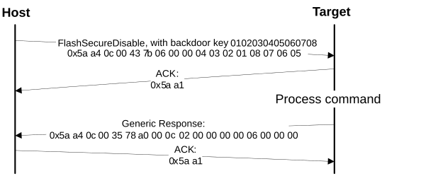

# FlashSecurityDisable command

The FlashSecurityDisable command performs the flash security disable operation by comparing the 8-byte backdoor key \(provided in the command\) against the backdoor key stored in the flash configuration field \(at address 0x400 in the flash\).

The backdoor low and high words are the only parameters required for the FlashSecurityDisable command.

**Parameters for FlashSecurityDisable Command**
|Byte \#|Command|
|:-----:|-------|
|0 - 3|Backdoor key low word|
|4 - 7|Backdoor key high word|

**Protocol Sequence for FlashSecurityDisable Command**

**FlashSecurityDisable Command Packet Format (Example)**
|FlashSecurityDisable|Parameter|Value|
|:------------------:|:--------|:----|
|Framing packet|start byte|0x5A|
||packetType|0xA4, kFramingPacketType\_Command|
||length|0x0C 0x00|
||crc16|0x43 0x7B|
|Command packet|commandTag|0x06 - FlashSecurityDisable|
||flags|0x00|
||reserved|0x00|
||parameterCount|0x02|
||Backdoorkey\_low|0x04 0x03 0x02 0x01|
||Backdoorkey\_high|0x08 0x07 0x06 0x05|

The FlashSecurityDisable command has no data phase.

**Response:** The target returns a GenericResponse packet with a status code either set to kStatus\_Success upon a successful execution of the command, or set to an appropriate error status code.

**Parent topic:**[MCU bootloader command API](../topics/mcu_bootloader_command_api.md)

