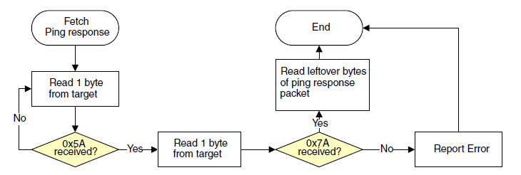
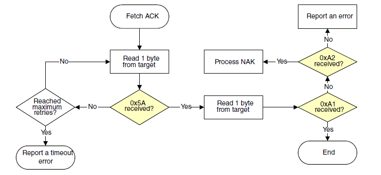
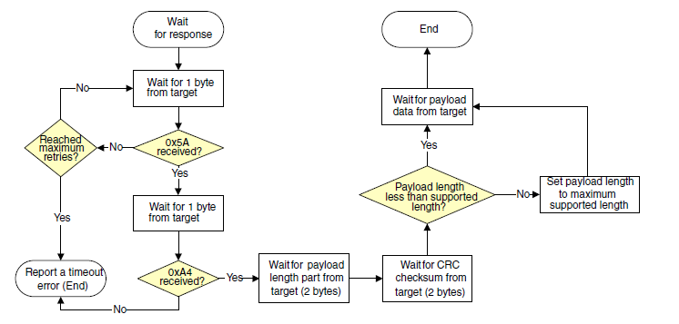

# FlexCAN Peripheral

The MCU Bootloader supports loading data into flash via the FlexCAN peripheral.

It supports four predefined speeds on FlexCAN transferring:

-   125 KHz
-   250 KHz
-   500 KHz
-   1 MHz

The curent FlexCAN IP can support up to 1 MHz speed, so the default speed is set to 1 MHz.

In host applications, the user can specify the speed for FlexCAN by providing the speed index as 0 through 4, which represents those 5 speeds.

In bootloader, this supports the auto speed detection feature within supported speeds. In the beginning, the bootloader enters the listen mode with the initial speed \(default speed 1 MHz\). Once the host starts sending a ping to a specific node, it generates traffic on the FlexCAN bus. Because the bootloader is in a listen mode. It is able to check if the local node speed is correct by detecting errors. If there is an error, some traffic will be visible, but it may not be on the right speed to see the real data. If this happens, the speed setting changes and checks for errors again. No error means the speed is correct. The settings change back to the normal receiving mode to see if there is a package for this node. It then stays in this speed until another host is using another speed and try to communicate with any node. It repeats the process to detect a right speed before sending host timeout and aborting the request.

The host side should have a reasonable time tolderance during the auto speed detect period. If it sends as timeout, it means there is no response from the specific node, or there is a real error and it needs to report the error to the application.

This flow chart shows the communication flow for how the host reads the ping packet, ACK, and response from the target.

**Host reads ping response from target via FlexCAN**

**Host reads ACK packet from target via FlexCAN**

**Host reads command response from target via FlexCAN**

**Parent topic:**[Supported peripherals](../topics/supported_peripherals_001.md)

