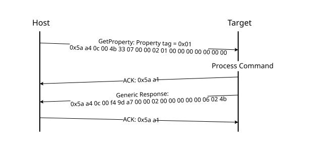

# GetProperty command

The GetProperty command is used to query the bootloader about various properties and settings. Each supported property has a unique 32-bit tag associated with it. The tag occupies the first parameter of the command packet. The target returns a GetPropertyResponse packet with the property values for the property identified with the tag in the GetProperty command.

The properties are the defined units of data that can be accessed with the GetProperty or SetProperty commands. The properties may be read-only or read-write. All read-write properties are 32-bit integers, so they can easily be carried in a command parameter.

For a list of properties and their associated 32-bit property tags supported by the MCU bootloader, see Appendix B, "GetProperty and SetProperty commands".

The 32-bit property tag is the only parameter required for the GetProperty command.

**Parameters for GetProperty command**
|Byte \#|Command|
|:-----:|-------|
|0 - 3|Property tag|
|4 - 7|External Memory Identifier \(only applies to get property for external memory\)|

**Protocol sequence for GetProperty command**

**GetProperty Response Packet Format (Example)**
|GetProperty|Parameter|Value|
|:---------:|:--------|:----|
|Framing packet|start byte|0x5A|
||packetType|0xA4, kFramingPacketType\_Command|
||length|0x0C 0x00|
||crc16|0x4B 0x33|
|Command packet|commandTag|0x07 – GetProperty|
||flags|0x00|
||reserved|0x00|
||parameterCount|0x02|
||propertyTag|0x00000001 - CurrentVersion|
||Memory ID|0x00000000 - Internal Flash \(0x00000001 - QSPI0 Memory\)|

The GetProperty command has no data phase.

**Response:** In response to a GetProperty command, the target sends a GetPropertyResponse packet with the response tag set to 0xA7. The parameter count indicates the number of parameters sent for the property values, with the first parameter showing the status code 0, followed by the property value\(s\). The following table shows an example of a GetPropertyResponse packet.

**GetProperty Response Packet Format (Example)**
|GetPropertyResponse|Parameter|Value|
|:-----------------:|:--------|:----|
|Framing packet|start byte|0x5A|
||packetType|0xA4, kFramingPacketType\_Command|
||length|0x0c 0x00 \(12 bytes\)|
||crc16|0xf4 9d|
|Command packet|responseTag|0xA7|
||flags|0x00|
||reserved|0x00|
||parameterCount|0x02|
||status|0x00000000|
||propertyValue|0x4b020600 - CurrentVersion|

**Parent topic:**[MCU bootloader command API](../topics/mcu_bootloader_command_api.md)

