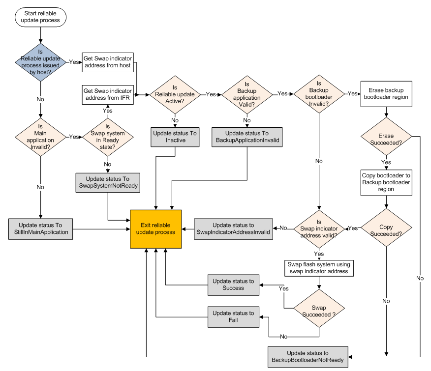

# Hardware implementation

For the hardware implementation, the backup application address is fixed and predefined in the bootloader, but a swap indicator address is required to swap the flash system. There are two ways for the bootloader to get the swap indicator address. If the reliable update process is issued by the host, the bootloader receives the specified swap indicator address from the host itself. Otherwise, the bootloader tries to receive the swap indicator address from the IFR, if the swap system is in the ready state.

The top level behavior of the reliable update process depends on how the bootloader gets the swap indicator address:

-   If the reliable update process is issued by the host, the bootloader does the same thing as software implementation until the validity of the backup application is verified.
-   If the reliable update process is from the bootloader startup sequence, the bootloader first checks the main application. If the main application is valid, then the bootloader exits the reliable update process immediately, and jumps to the main application. Otherwise, the bootloader receives the swap indicator address from IFR, then continues to validate the integrity of the backup application as the software implementation.

**Note:** It is expected that the user erases the main application region when reliable update process is intended with the next startup sequence. Otherwise, the reliable update process assumes no update is required, exits the process, and boots the image from the main application region

If the backup application is valid, see the remaining operations in the following figure.

**Reliable update hardware implementation workflow**

**Note:** Not all details are shown in the above figure.

Once the flash system is swapped \(upper flash block becomes lower flash block\), the bootloader naturally treats the backup application as the main application. In the hardware implementation, after the swap, it is not necessary to erase the image from the backup region.

**Parent topic:**[Reliable update flow](../topics/reliable_update_flow.md)

