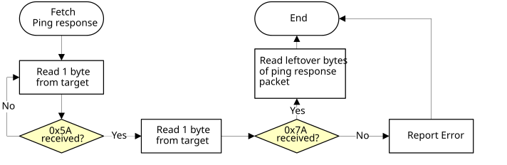
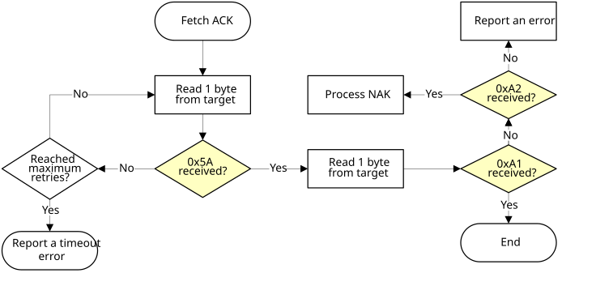
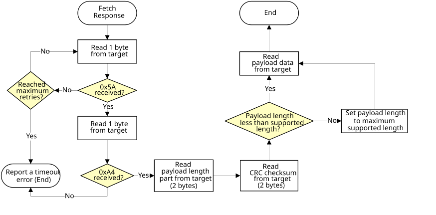

# I2C peripheral

The MCU bootloader supports loading data into flash via the I2C peripheral, where the I2C peripheral serves as the I2C slave. A 7-bit slave address is used during the transfer.

Customizing an I2C slave address is also supported. This feature is enabled if the Bootloader Configuration Area \(BCA\) is enabled \(tag field is filled with ‘kcfg’\) and the i2cSlaveAddress field is filled with a value other than 0xFF. Otherwise, 0x10 is used as the default I2C slave address.

The MCU bootloader uses 0x10 as the I2C slave address, and supports 400 kbit/s as the I2C baud rate.

The maximum supported I2C baud rate depends on corresponding clock configuration field in the BCA. The typical baud rate is 400 kbit/s with factory settings. The actual supported baud rate may be lower or higher than 400 kbit/s, depending on the actual value of the clockFlags and the clockDivider fields.

Because the I2C peripheral serves as an I2C slave device, each transfer should be started by the host, and each outgoing packet should be fetched by the host.

-   An incoming packet is sent by the host with a selected I2C slave address and the direction bit is set as write.
-   An outgoing packet is read by the host with a selected I2C slave address and the direction bit is set as read.
-   0x00 is sent as the response to host if the target is busy with processing or preparing data.

The following charts show the communication flow of the host reading the ping and ACK packets, and the corresponding responses from the target.

**Host reads ping response from target via I2C**


**Host reads ACK packet from target via I2C**
|

**Host reads response from target via I2C**



```{include} ../topics/performance_numbers_for_i2c.md
:heading-offset: 2
```

**Parent topic:**[Supported peripherals](../topics/supported_peripherals_001.md)

