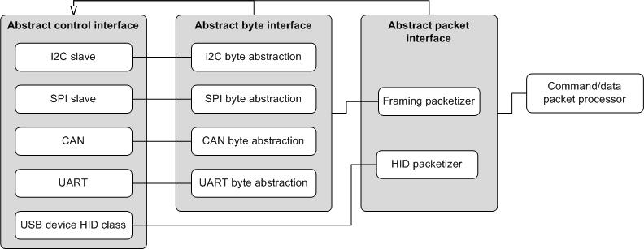
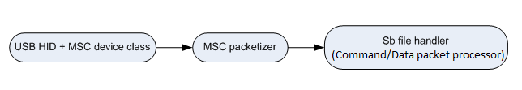

# Introduction - Peripheral interfaces

The block diagram shows connections between components in the architecture of the peripheral interface.

**Components peripheral interface**

**USB/MSC Peripheral interface**

In this diagram, the byte and packet interfaces are shown to inherit from the control interface.

All peripheral drivers implement an abstract interface built on top of the driver's internal interface. The outermost abstract interface is a packet-level interface. It returns the payload of packets to the caller. Drivers that use framing packets have another abstract interface layer that operates at the byte level. The abstract interfaces allow the higher layers to use exactly the same code regardless which peripheral is being used.

The abstract packet interface feeds into the command and data packet processor. This component interprets the packets returned by the lower layer as command or data packets.

**Parent topic:**[Peripheral interfaces](../topics/peripheral_interfaces.md)

