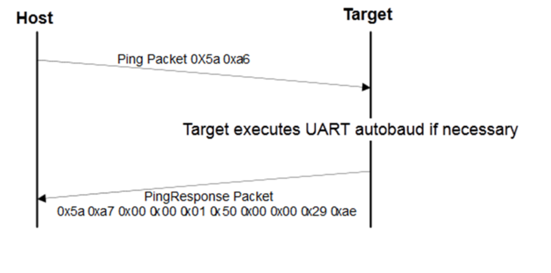

# Ping packet

The Ping packet is the first packet sent from the host to the target to establish a connection on a selected peripheral to run the autobaud. The Ping packet can be sent from the host to the target anytime that the target is expecting a command packet. If the selected peripheral is UART, the ping packet must be sent before any other communications. For other serial peripherals it is optional, but it is recommended to determine the serial protocol version.

In response to the Ping packet, the target sends the Ping Response packet, discussed further on in the document.

**Ping packet format**
|Byte \#|Value|Name|
|:-----:|:---:|:--:|
|0|0x5A|start byte|
|1|0xA6|ping|

**Ping packet protocol sequence**

**Parent topic:**[Bootloader packet types](../topics/bootloader_packet_types.md)

