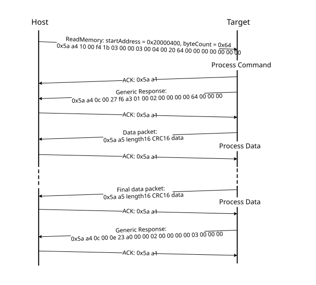

# ReadMemory command

The ReadMemory command returns the contents of the memory at the given address for a specified number of bytes. This command can read any region of memory accessible by the CPU and is not protected by security.

The start address and the number of bytes are the two parameters required for the ReadMemory command.

**Parameters for ReadMemory command**
|Byte|Parameter|Description|
|:--:|:-------:|-----------|
|0 - 3|Start address|Start address of memory to read from|
|4 - 7|Byte count|Number of bytes to read and return to caller|
|8 - 11|Memory ID|Internal or external memory Identifier|

**Command sequence for ReadMemory command**

**ReadMemory packet format example**
|ReadMemory|Parameter|Value|
|:--------:|:-------:|-----|
|Framing packet|Start byte|0x5A0xA4,|
||packetType|kFramingPacketType\_Command|
||length|0x10 00|
||crc16|0xf4 1b|
|Command packet|commandTag|0x03 - readMemory|
||flags|0x00|
||reserved|0x00|
||parameterCount|0x03|
||startAddress|0x20000400|
||byteCount|0x00000064|
||memoryID|0x0| |

**Data Phase:** The ReadMemory command has a data phase. Because the target works in the slave mode, the host must pull the data packets until the number of bytes of data specified in the byteCount parameter of the ReadMemory command are received by the host.

**Response:** The target returns a GenericResponse packet with a status code either set to kStatus\_Success upon a successful execution of the command, or set to an appropriate error status code.

**Parent topic:**[MCU bootloader command API](../topics/mcu_bootloader_command_api.md)

