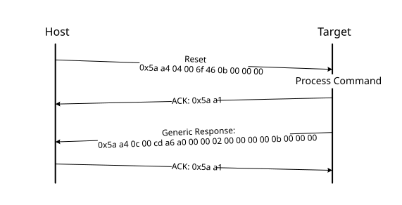

# Reset command

The Reset command results in the bootloader resetting the chip.

The Reset command requires no parameters.

**Protocol Sequence for Reset Command**

**Reset Command Packet Format (Example)**
|Reset|Parameter|Value|
|:---:|:--------|:----|
|Framing packet|start byte|0x5A|
||packetType|0xA4, kFramingPacketType\_Command|
||length|0x04 0x00|
||crc16|0x6F 0x46|
|Command packet|commandTag|0x0B - reset|
||flags|0x00|
||reserved|0x00|
||parameterCount|0x02|

The Reset command has no data phase.

**Response:** The target returns a GenericResponse packet with a status code set to kStatus\_Success before resetting the chip.

The Reset command can also be used to switch the boot from the flash after a successful flash image provisioning via the ROM bootloader. After issuing the reset command, wait five seconds for the user application to start running from the flash.

**Parent topic:**[MCU bootloader command API](../topics/mcu_bootloader_command_api.md)

