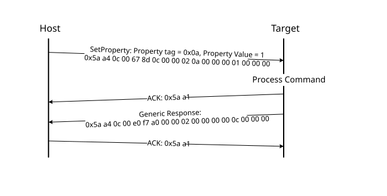

# SetProperty command

The SetProperty command is used to change or alter the values of the properties or options of the bootloader. The command accepts the same property tags used with the GetProperty command. However, only some properties are writable--see Appendix B. If an attempt to write a read-only property is made, an error is returned indicating that the property is read-only and cannot be changed.

The property tag and the new value to set are the two parameters required for the SetProperty command.

**Parameters for SetProperty Command**
|Byte \#|Command|
|:-----:|-------|
|0 - 3|Property tag|
|4 - 7|Property value|

**Protocol Sequence for SetProperty Command**

**SetProperty Command Packet Format (Example)**
|SetProperty|Parameter|Value|
|:---------:|:--------|:----|
|Framing packet|start byte|0x5A|
||packetType|0xA4, kFramingPacketType\_Command|
||length|0x0C 0x00|
||crc16|0x67 0x8D|
|Command packet|commandTag|0x0C – SetProperty with property tag 10|
||flags|0x00|
||reserved|0x00|
||parameterCount|0x02|
||propertyTag|0x0000000A - VerifyWrites|
||propertyValue|0x00000001|

The SetProperty command has no data phase.

**Response:** The target returns a GenericResponse packet with one of the following status codes:

**SetProperty Response Status Codes**
|Status Code|
|:----------|
|kStatus\_Success|
|kStatus\_ReadOnly|
|kStatus\_UnknownProperty|
|kStatus\_InvalidArgument|

**Parent topic:**[MCU bootloader command API](../topics/mcu_bootloader_command_api.md)

