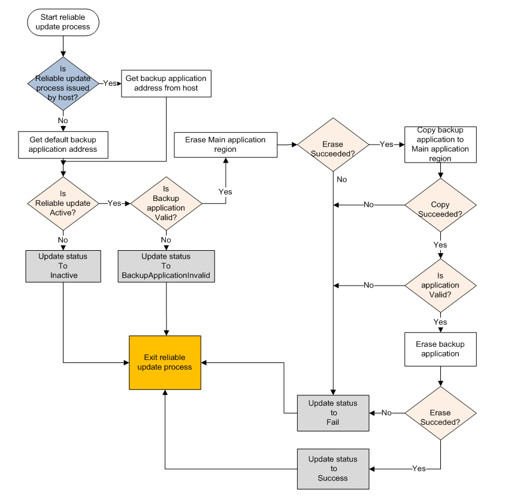

# Software implementation

For software implementation, the backup application address is not fixed. Therefore, the application address must be specified. There are two ways for the bootloader to receive the backup application address. If the reliable update process is issued by the host, the bootloader receives the specified application address from the host itself. Otherwise, the bootloader uses the predefined application address.

After the reliable update process starts, the first thing for the bootloader is to check the backup application region . This is to determine if the reliable update feature is active by checking:

1.  If the application pointer in the backup application is valid.
2.  If the Bootloader Configuration Area is enabled.

If above conditions are not met, the bootloader exits the reliable update process immediately. Else, the bootloader continues to validate the integrity of the backup application by checking: the following

1.  Is crcStartAddress is equal to the start address of the vector table of the application.
2.  Is crcByteCount \(considered as the size of backup application\) is less than or equal to the maximum allowed backup application size.
3.  Is the calculated CRC checksum is equal to the checksum provided in backup application, given that the above conditions are met.

If the backup application is determined to be valid, the remaining process is described in the following figure.

**Reliable update software implementation workflow**

**Note:** Not all details are shown in the above figure.

Once the main application region is updated, the bootloader must erase the backup application region before exiting the reliable update process. This prevents the bootloader to update the main application image on subsequent boots.

**Parent topic:**[Reliable update flow](../topics/reliable_update_flow.md)

