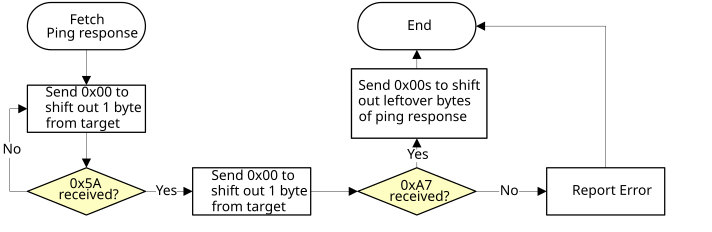
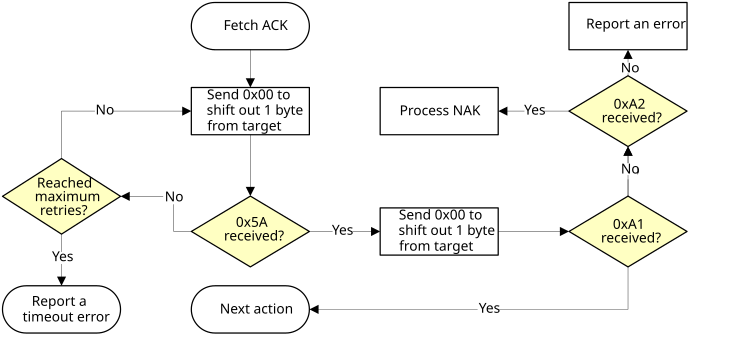
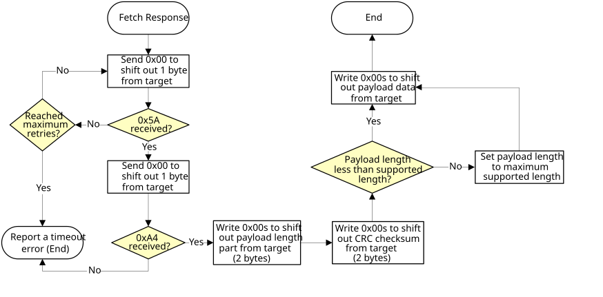

# SPI Peripheral

The MCU bootloader supports loading data into flash via the SPI peripheral, where the SPI peripheral serves as a SPI slave.

The maximum supported baud rate of the SPI depends on the clock configuration fields in the Bootloader Configuration Area \(BCA\). The typical baud rate is 400 kbit/s with the factory settings. The actual baud rate is lower or higher than 400 kbit/s, depending on the actual value of the clockFlags and clockDivider fields in the BCA.

Because the SPI peripheral serves as a SPI slave device, each transfer should be started by the host, and each outgoing packet should be fetched by the host.

The transfer on SPI is slightly different from I2C:

-   Host receives 1 byte after it sends out any byte.
-   Received bytes should be ignored when host is sending out bytes to target
-   Host starts reading bytes by sending 0x00s to target
-   The byte 0x00 is sent as response to host if target is under the following conditions:
    -   Processing incoming packet
    -   Preparing outgoing data
    -   Received invalid data

The following flowcharts show how the host reads a ping response, an ACK and a command response from target via SPI.

**Host reads ping packet from target via SPI**


**Host reads ACK from target via SPI**


**Host reads response from target via SPI**



```{include} ../topics/performance_numbers_for_spi.md
:heading-offset: 2
```

**Parent topic:**[Supported peripherals](../topics/supported_peripherals_001.md)

