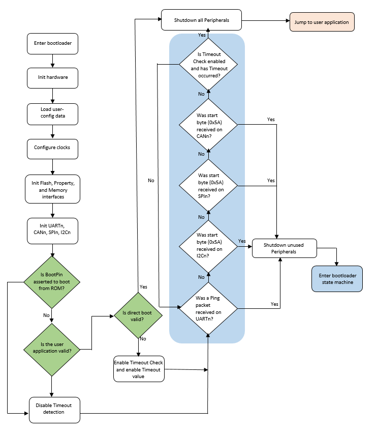

# Start-up process

It is important to note that the startup process for bootloader in ROM, RAM \(flashloader\), and flash \(flash-resident\) are slightly different. See the chip-specific reference manual for understanding the startup process for the ROM bootloader and flashloader. This section focuses on the flash-resident bootloader startup only.

There are two ways to get into the flash-resident bootloader.

1.  If the vector table at the start of internal flash holds a valid PC and SP, the hardware boots into the bootloader.
2.  A user application running on flash or RAM calls into the MCU bootloader entry point address in flash to start the MCU bootloader execution.

After the MCU bootloader has started, the following procedure starts the bootloader operations:

1.  Initializes the bootloader .data and .bss sections.
2.  Reads the bootloader configuration data from flash at offset 0x3C0. The configuration data is only used if the tag field is set to the expected 'kcfg' value. If the tag is incorrect, the configuration values are set to default, as if the data was all 0xFF bytes.
3.  Clocks are configured.
4.  Enabled peripherals are initialized.
5.  The the bootloader waits for communication to begin on a peripheral.
    -   If detection times out, the bootloader jumps to the user application in flash if the valid PC and SP addresses are specified in the application vector table.
    -   If communication is detected, all inactive peripherals are shut down, and the command phase is entered.

**MCU bootloader start-up flowchart**

**Parent topic:**[Functional description](../topics/functional_description.md)

