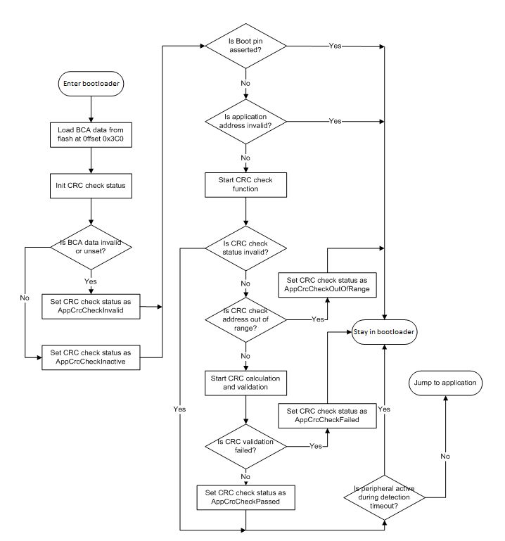

# Staying in or leaving bootloader

If no active peripheral is found before the end of the detection, the timeout period expires, and the current CRC check status is either set to kStatus\_AppCrcCheckInvalid \(integrity check is not enabled for the device\), or kStatus\_AppCrcCheckPassed. Then, the bootloader jumps to the application image. Otherwise, the bootloader enters the active state and wait for commands from the host.

**Application integrity check flow**

The following table provides the CRC algorithm which is used for the application integrity check. The CRC algorithm is the MPEG2 variant of CRC-32.

The characteristics of the MPEG2 variant are:

**MPEG2 variant characteristics**
|Width|32|
|-----|--|
|Polynomial|0x04C11BD7|
|Init Value|0xFFFFFFFF|
|Reflect In|FALSE|
|Reflect Out|FALSE|
|XOR Out|0x00000000|

The bootloader computes the CRC over each byte in the application range specified in the BCA, excluding the crcExpectedValue field in the BCA. In addition, MCU bootloader automatically pads the extra byte\(s\) with zero\(s\) to finalize CRC calculation if the length of the image is not 4-bytes aligned.

The following procedure shows the steps in CRC calculation.

-   CRC initialization
    -   Set the initial CRC as 0xFFFFFFFF, which clears the CRC byte count to 0.
-   CRC calculation
    -   Check if the crcExpectedValue field in BCA resides in the address range specified for CRC calculation.
        -   If the crcExpectedValue does not reside in the address range, then compute CRC over every byte value in the address range.
        -   If the crcExpectedValue does reside in the address range, then split the address range into two parts, splitting at the address of crcExpectedValue field in BCA excluding crcExpectedValue. Then, compute the CRC on the two parts.
    -   Adjust the CRC byte count according to the actual bytes computed.
-   CRC finalization
    -   Check if the CRC byte count is not 4-bytes aligned. If it is 4-bytes aligned, then pad it with necessary zeroes to finalize the CRC. Otherwise, return the current computed CRC.

**Note:** MCU bootloader assumes that crcExpectedValue field \(4 bytes\) resides in the CRC address range completely if it borders on the CRC address range.

**Parent topic:**[MCU bootloader flow with integrity checker](../topics/mcu_bootloader_flow_with_integrity_checker.md)

