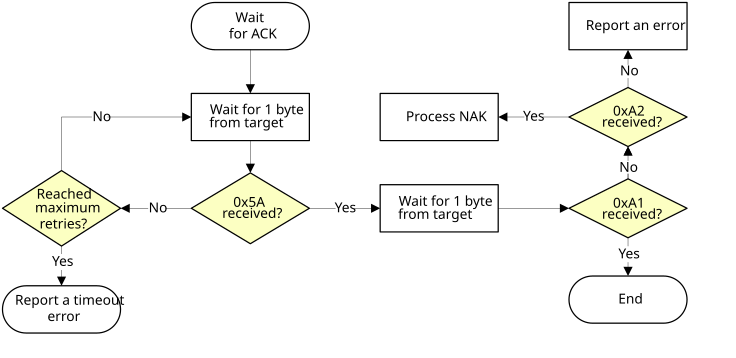
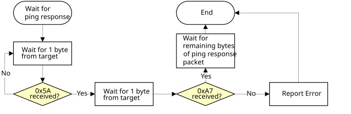
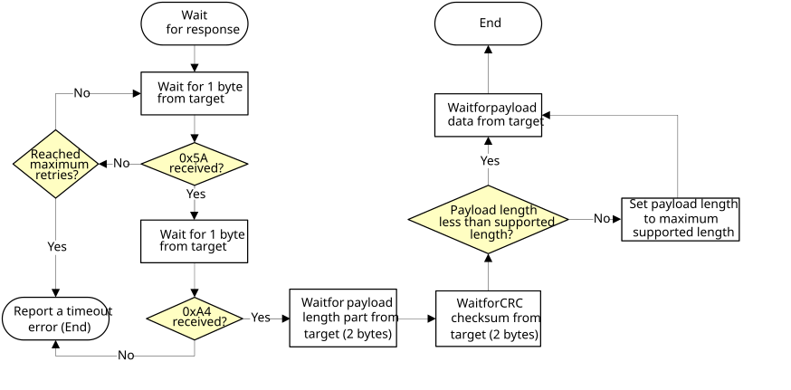

# UART peripheral

The MCU bootloader integrates an autobaud detection algorithm for the UART peripheral, thereby providing flexible baud rate choices.

**Autobaud feature:** If UART*n* is used to connect to the bootloader, then the UART*n*\_RX pin must be kept high and not left floating during the detection phase in order to comply with the autobaud detection algorithm. After the bootloader detects the ping packet \(0x5A 0xA6\) on UART*n*\_RX, the bootloader firmware executes the autobaud sequence. If the baudrate is successfully detected, then the bootloader sends a ping packet response \[\(0x5A 0xA7\), protocol version \(4 bytes\), protocol version options \(2 bytes\), and crc16 \(2 bytes\)\] at the detected baudrate. The MCU bootloader then enters a loop, waiting for bootloader commands via the UART peripheral.

**Note:** The data bytes of the ping packet must be sent continuously \(with no more than 80 ms between bytes\) in a fixed UART transmission mode \(8-bit data, no parity bit, and 1 stop bit\). If the bytes of the ping packet are sent one-by-one with more than an 80 ms delay between them, then the autobaud detection algorithm may calculate an incorrect baud rate. In this instance, the autobaud detection state machine should be reset.

**Supported baud rates:** The baud rate is closely related to the MCU core and system clock frequencies. Typical baud rates supported are 9600, 19200, 38400, and 57600. Of course, to influence the performance of autobaud detection, the clock configuration in BCA can be changed.

**Packet transfer:** After autobaud detection succeeds, bootloader communications can take place over the UART peripheral. The following flow charts show:

-   How the host detects an ACK from the target
-   How the host detects a ping response from the target
-   How the host detects a command response from the target

**Host reads an ACK from target via UART**


**Host reads a ping response from target via UART**


**Host reads a command response from target via UART**



```{include} ../topics/performance_numbers_for_uart.md
:heading-offset: 2
```

**Parent topic:**[Supported peripherals](../topics/supported_peripherals_001.md)

