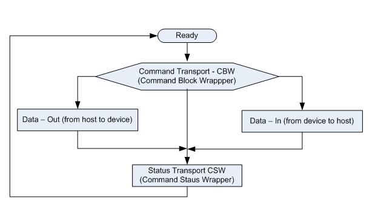

# USB HID packetizer

The USB HID packetizer implements the abstract packet interface for USB HID, taking advantage of the USB's inherent flow control and error detection capabilities.

The image shows the USB MSC command/data/status flow chart.

**USB MSC status flow chart**

-   The CBW begins on a packet boundary, and ends as a short packet. Exactly 31 bytes are transferred.
-   The CSW begins on a packet boundary, and ends as a short packet. Exactly 13 bytes are transferred.
-   The data packet begins on a packet boundary, and ends as a short packet. Exactly 64 bytes are transferred.

**Parent topic:**[Peripheral interfaces](../topics/peripheral_interfaces.md)

