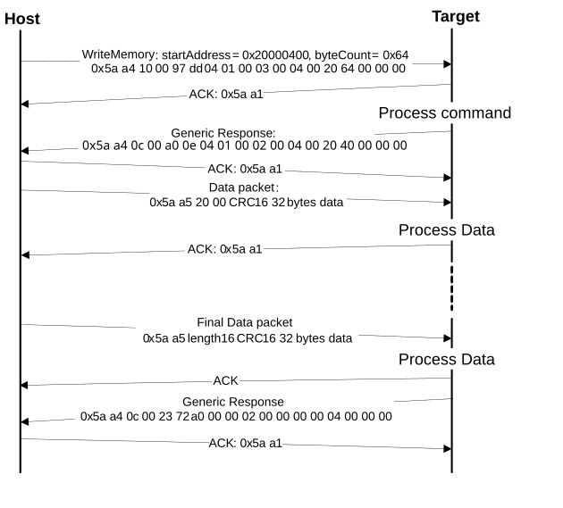

# WriteMemory command

The WriteMemory command writes the data provided in the data phase to a specified range of bytes in the memory \(flash or RAM\). However, if the flash protection is enabled, then the writes to the protected sectors fail.

Special care must be taken when writing to the flash.

-   First, any flash sector written to must be previously erased with the FlashEraseAll, FlashEraseRegion, or FlashEraseAllUnsecure command.
-   First, any flash sector written to must be previously erased with the FlashEraseAll or FlashEraseRegion command.
-   Writing to the flash requires the start address to be 4-byte aligned \(\[1:0\] = 00\).
-   The byte count is rounded up to a multiple of 4, and the trailing bytes are filled with the flash erase pattern \(0xff\).
-   If the VerifyWrites property is set to true, then the writes to the flash also perform a flash verify program operation.

When writing to the RAM, the start address does not need to be aligned, and the data is not padded.

The start address and the number of bytes are the two parameters required for the WriteMemory command.

**Parameters for WriteMemory Command**
|Byte \#|Command|
|:-----:|-------|
|0 - 3|Start address|
|4 - 7|Byte count|
|8 - 11|Memory ID|

**Protocol Sequence for WriteMemory Command**

**WriteMemory Command Packet Format (Example)**
|WriteMemory|Parameter|Value|
|:---------:|:--------|:----|
|Framing packet|start byte|0x5A|
||packetType|0xA4, kFramingPacketType\_Command|
||length|0x10 00|
||crc16|0x97 DD|
|Command packet|commandTag|0x04 - writeMemory|
||flags|0x01|
||reserved|0x00|
||parameterCount|0x03|
||startAddress|0x20000400|
||byteCount|0x00000064|
||memoryID|0x0| |

**Data Phase:** The WriteMemory command has a data phase; the host sends data packets until the number of bytes of data specified in the byteCount parameter of the WriteMemory command are received by the target.

**Response:** The target returns the GenericResponse packet with a status code set to kStatus\_Success upon a successful execution of the command, or to an appropriate error status code.

**Parent topic:**[MCU bootloader command API](../topics/mcu_bootloader_command_api.md)

