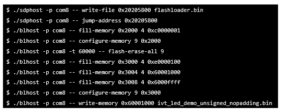

# Generate encrypted XIP image

On-the-fly AES decryption \(OTFAD\) engine is embedded in certain models of i.MX RT devices. If an SNVS key is selected as OTFAD’s KEK, the pre-encryption process has to be performed on-chip, where the MCU flashloader can be applied. In this case, the following steps are required:

1.  **Step 1**: Generate a signed or unsigned bootable application image, as is stated in 4.2 or 4.3.
2.  **Step 2**: Generate a flashloader image in the similar manner to 4.3, with flashloader.srec provided in the release package and the BD file below:

    ```
    options {
        flags = 0x08;
        startAddress = 0x20205800;
        ivtOffset = 0x0;
        initialLoadSize = 0x2000;
        entryPointAddress = 0x20205a00;
    }
    sources {
        elfFile = extern(0);
    }
    constants {
        SEC_CSF_HEADER              = 20;
        SEC_CSF_INSTALL_SRK         = 21;
        SEC_CSF_INSTALL_CSFK        = 22;
        SEC_CSF_INSTALL_NOCAK       = 23;
        SEC_CSF_AUTHENTICATE_CSF    = 24;
        SEC_CSF_INSTALL_KEY         = 25;
        SEC_CSF_AUTHENTICATE_DATA   = 26;
        SEC_CSF_INSTALL_SECRET_KEY  = 27;
        SEC_CSF_DECRYPT_DATA        = 28;
        SEC_NOP                     = 29;
        SEC_SET_MID                 = 30;
        SEC_SET_ENGINE              = 31;
        SEC_INIT                    = 32;
        SEC_UNLOCK                  = 33;
    }
    section (SEC_CSF_HEADER;
        Header_Version="4.2",
        Header_HashAlgorithm="sha256",
        Header_Engine="ANY",
        Header_EngineConfiguration=0,
        Header_CertificateFormat="x509",
        Header_SignatureFormat="CMS"
        )
    {
    }
    section (SEC_CSF_INSTALL_SRK;
        InstallSRK_Table="keys/SRK_1_2_3_4_1024_table.bin", // "valid file path"
        InstallSRK_SourceIndex=0
        )
    {
    }
    section (SEC_CSF_INSTALL_CSFK;
        InstallCSFK_File="crts/CSF1_1_sha256_1024_65537_v3_usr_crt.pem",
        InstallCSFK_CertificateFormat="x509" // "x509"
        )
    {
    }
    section (SEC_CSF_AUTHENTICATE_CSF)
    {
    }
    section (SEC_CSF_INSTALL_KEY;
        InstallKey_File="crts/IMG1_1_sha256_1024_65537_v3_usr_crt.pem",
        InstallKey_VerificationIndex=0, // Accepts integer or string
        InstallKey_TargetIndex=2) // Accepts integer or string
    {
    }
    section (SEC_CSF_AUTHENTICATE_DATA;
        AuthenticateData_VerificationIndex=2,
        AuthenticateData_Engine="ANY",
        AuthenticateData_EngineConfiguration=0)
    {
    }
    section (SEC_SET_ENGINE;
        SetEngine_HashAlgorithm = "sha256", // "sha1", "Sha256", "sha512"
        SetEngine_Engine = "ANY", // "ANY", "SAHARA", "RTIC", "DCP", "CAAM" and "SW"
        SetEngine_EngineConfiguration = "0") // "valid engine configuration values"
    {
    }
    section (SEC_UNLOCK;
        Unlock_Engine = "SNVS, OCOTP", // "SRTC", "CAAM", SNVS and OCOTP
        Unlock_features = "ZMK WRITE, SRK REVOKE" // "Refer to Table-24"
        )
    {
    }
    
    ```

    Assume the generated file’s name is “flashloader.bin” \(or “flashloader\_nopadding.bin”, actually they are identical so either can be used in the following steps\).

3.  **Step 3**: Copy “flashloader.bin” and the “sdphost”, “blhost” executables provided in the release package into the same folder as the bootable application image in Step 1.
4.  **Step 4**: Generate and program the encrypted XIP image on-chip \(via the serial port as an example\):

    **Example command to generate and program an encrypted XIP image on-chip**

    

    See MCU Flashloader Reference Manual for more detailed information.