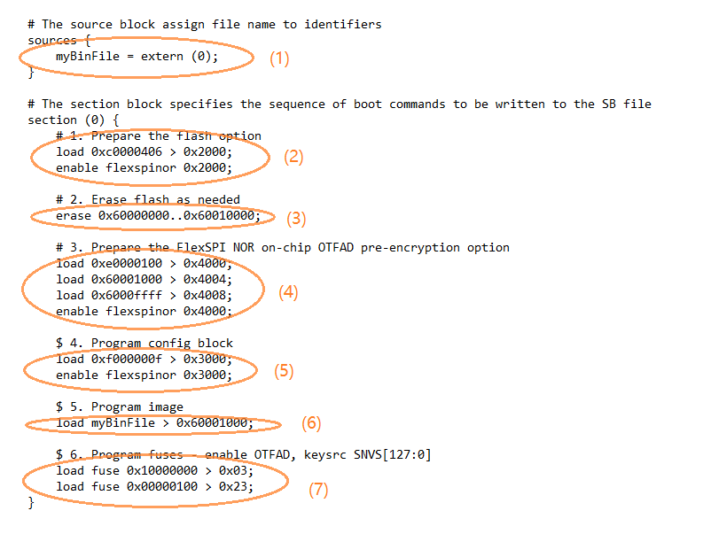

# Generate SB file for FlexSPI NOR Image encryption and programming

Usually, a BD file for FlexSPI NOR image encryption and programming consists of seven steps.

1.  The bootable image file path is provided in sources block.
2.  Enable FlexSPI NOR access using FlexSPI NOR Configuration Option block.
3.  Erase the flash device if it is not blank. The erase operation is time consuming and is not required for a blank flash device \(factory setting\) during manufacturing.
4.  Enable image encryption using FlexSPI NOR on-chip OTFAD pre-encryption option block.
5.  Program FNORCB using magic number.
6.  Program boot image binary into Serial NOR via FlexSPI module.
7.  Enable Encrypted XIP fuse bits.

**Note:** For redundant boot images, it is necessary to embed the FNORCB in the bin file to ensure FNORCB be programmed to 0x60000400. In this case step 5 should be skipped.

**Example BD file for encrypted FlexSPI NOR image generation and programming**

The steps to generate SB file is the same as in the above section.