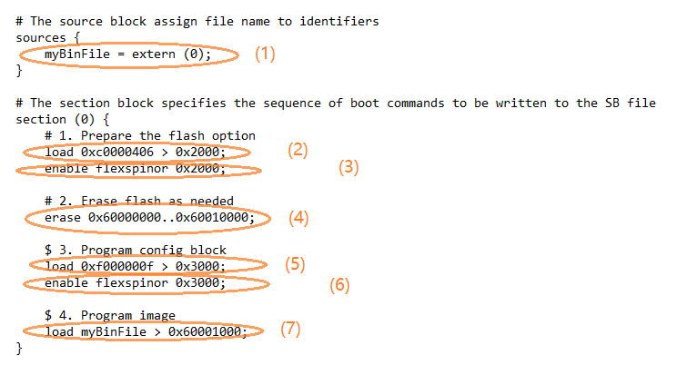
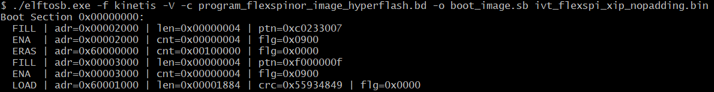

# Generate SB file for plaintext FlexSPI NOR image programming

Usually, a BD file for FlexSPI NOR boot consists of seven parts.

1.  The bootable image file path is provided in sources block.
2.  The FlexSPI NOR Configuration Option block is provided in section block.
3.  To enable FlexSPI NOR access, the “enable” command must be used after the option block.
4.  If the flash device is not erased, an “erase” command is required before programming data to the flash device. The erase operation is time consuming and is not required for a blank flash device \(factory setting\) during manufacturing.
5.  The FlexSPI NOR Configuration Block \(FNORCB\) is required for FlexSPI NOR boot. To program the FNORCB generated by FlexSPI NOR Configuration Option block, a special magic number ‘0xF000000F” must be loaded into RAM first.
6.  To notify the flashloader to program the FNORCB, an “enable” command must be used after the magic number is loaded.
7.  After the above operation, the flashloader can program the bootable image binary into Serial NOR Flash through FlexSPI module using the load command.

**Note:** For redundant boot images, it is necessary to embed the FNORCB in the bin file to ensure FNORCB be programmed to 0x60000400. In this case steps 5 and 6 should be skipped.

An example containing the above steps is shown in the figure below.

**Example BD file for FlexSPI NOR programming**

Here is an example to generate SB file using the elftosb utility, ivt\_flexspi\_nor\_xip.bin, and BD file shown in the figure below.

**Example command to generate SB file for FlexSPI NOR programming**

After the above command, a file named boot\_image.sb will be created in the same folder that holds the elftosb utility executable.