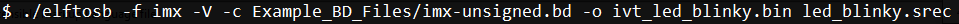

# Generate unsigned normal i.MX RT bootable image

Typically, the unsigned bootable image is generated and programmed to the destination memory during the development phase.

The elftosb utility supports unsigned bootable image generation using options, BD file, and ELF/SREC file generated by toolchain.

Using the LED blinky project as an example, here are the steps to create a bootable image for the Flashloader.

1.  **Step 1:** Create a BD file. For unsigned image creation, the “constants” block is optional, as shown below.

    ```
    options {
        flags = 0x00;
        startAddress = 0x60000000;
        ivtOffset = 0x1000;
        initialLoadSize = 0x2000;
    }
    sources {
        elfFile = extern(0);
    }
    section (0)
    {
    }
    ```

    After the BD file is created, place it into the same folder that has the elftosb utility executable.

2.  **Step 2:** Copy led-blinky.srec provided in the release package into the same folder that has the elftosb utility executable.
3.  **Step 3:** Generate the bootable image using the elftosb utility.

    **Example command to generate SB file for FlexSPI NOR programming**

    

    Then, there are two bootable images generated by the elftosb utility.

    The first one is ivt\_flashloader\_unsigned.bin. The memory regions from 0 to ivt\_offset are filled with padding bytes \(all 0x00s\).

    The second one is ivt\_led\_blinky\_unsigned\_nopadding.bin, which starts from ivtdata directly without any padding before ivt.