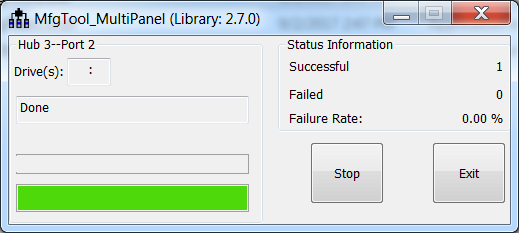

# Program bootable image during development

In development phase, the device may be in HAB open mode for most use cases. Users can configure the “name” field in cfg.ini file as <Device\>-DevBoot, then prepare the boot\_image.sb file using the elftosb utility. After the “boot\_image.sb” is generated, place it into “<Device\>/OS Firmware/” folder. Then put device into serial downloader mode and connect it to host PC. After opening the MfgTool2.exe and click “Start” to trigger a programming sequence. When the programming completes, the window shown in the figure below appears. To exit MfgTool, click “Stop” and then “Exit”.

**Successful result for programming with MfgTool for DevBoot**
  
