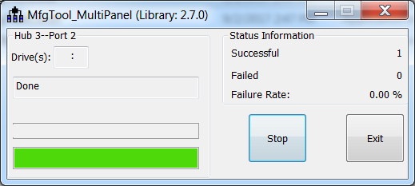

# Program bootable image for production

In production phase, the device can be in HAB closed mode for most use cases. Users can configure the “name” field in cfg.ini file as <Device\>-SecureBoot, then prepare the boot\_image.sb file, enable\_hab.sb and ivt\_flashloader\_signed.bin using the elftosb utility. After all are generated, place them into “<Device\>/OS Firmware/” folder, then put device in serial downloader, connect it to host PC. Open MfgTool2.exe and click “Start” to trigger a programming sequence. After the programming completes, the window below will be seen. To exit MfgTool, click “Stop” and then “Exit”.

**Successful result for programming with MfgTool for Secure Boot**

