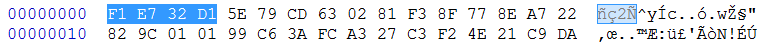
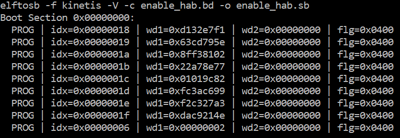

# Create SB file for Fuse programming

In the keys folder, there is a file named “SRK\_1\_2\_3\_4\_fuse.bin”. This is the HASH table for SRK authentication during boot. It must be programmed to fuses to enable secure boot mode.

Below is an example file

**Example SRK\_1\_2\_3\_4\_fuse.bin file**



Below is an example BD file which shows the procedure to program fuses. The fuse field is a 32-bit long word data. It will be programmed into the fuses by Flashloader in little-endian mode.

```
# The source block assign file name to identifiers
sources {
}
constants {
}
# The section block specifies the sequence of boot commands to be written to the SB file
# Note: this is just a template, please update it to actual values in users' project
section (0) {
    # Program SRK table
    load fuse 0xD132E7F1 > 0x18;
    load fuse 0x63CD795E > 0x19;
    load fuse 0x8FF38102 > 0x1A;
    load fuse 0x22A78E77 > 0x1B;
    load fuse 0x01019c82 > 0x1C;
    load fuse 0xFC3AC699 > 0x1D;
    load fuse 0xF2C327A3 > 0x1E;
    load fuse 0xDAC9214E > 0x1F;
    # Program SEC_CONFIG to enable HAB closed mode
    load fuse 0x00000002 > 0x06;
}
```

The last command in above BD file is used to enable HAB closed mode by setting SEC\_CONFIG \[1\] bit in the fuse to 1.

After BD file is ready, the next step is to create SB file for Fuse programming to enable HAB closed mode.

An example command is shown below:

**Example command to generate SB file for Fuse programming**



After the command “enable\_hab.bd -o enable\_hab.sb” in the figure above is executed, a file named “enable\_hab.sb” gets generated. It is required in MfgTool for Secure Boot solution.