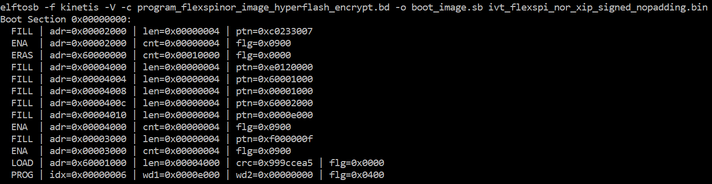

# Create SB file for Image encryption and programming for Flash

Following chapter 5, here is an example to generate the SB file for image encryption and programming on Flash for MIMXRT1015-EVK board.

Refer to the BD file in [Section 5.1.3, Generate SB file for FlexSPI NOR Image encryption and programming](generate_sb_file_for_flexspi_nor_image_encryption_.md).

After the BD file is ready, the next step is to generate the SB file. Refer below for an example command.

**Example command to generate SB file for FlexSPI NOR image encryption and programming**

After the command “program\_flexspinor\_image\_encrypt.bd -o boot\_image.sb ivt\_flexspi\_nor\_xip\_signed\_nopadding.bin” in the figure above , a file named “boot\_image.sb” is generated in the folder that contains the elftosb utility executable.