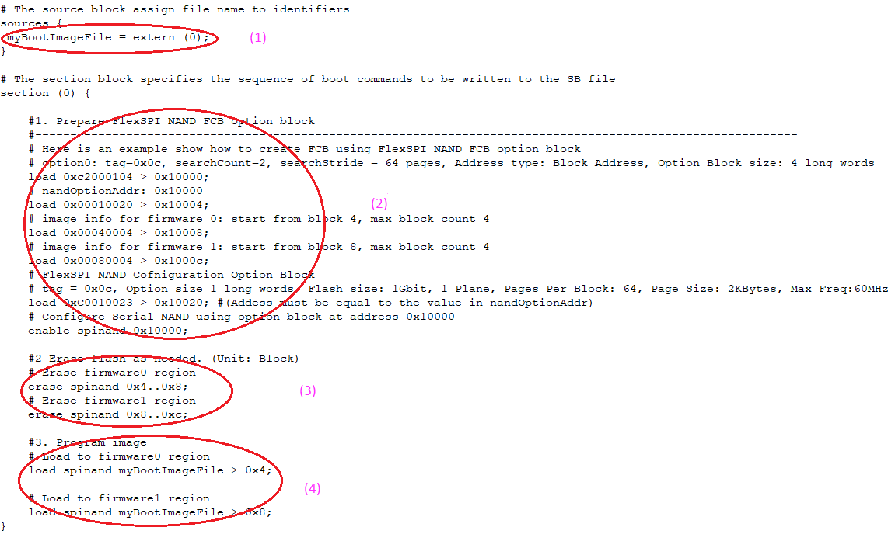

# Generate SB file for FlexSPI NAND image programming

In general, a BD file for FlexSPI NAND image programming consists of 4 steps.

1.  The bootable image file path is provided in sources block.
2.  Enable FlexSPI NAND access using FlexSPI NAND Configuration Option block.
3.  Erase SPI NAND device as needed.
4.  Program boot image binary into Serial NAND via FlexSPI module.

**Example BD file for FlexSPI NAND image programming**

