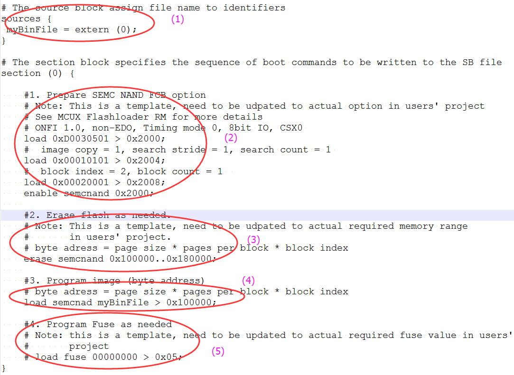

# Generate SB file for SEMC NAND image programming

There are 5 steps in the BD file to program the bootable image to SD card.

1.  The bootable image file path is provided in sources block.
2.  Prepare SEMC NAND FCB option block and SEMC NAND access using enable command.
3.  Erase SEMC NAND memory as required.
4.  Program boot image binary into SEMC NAND device.
5.  Program optimal SEMC NAND access parameters to Fuse as required.

An example is shown in the figure below.

**Example BD file for SEMC NAND boot image programming**

