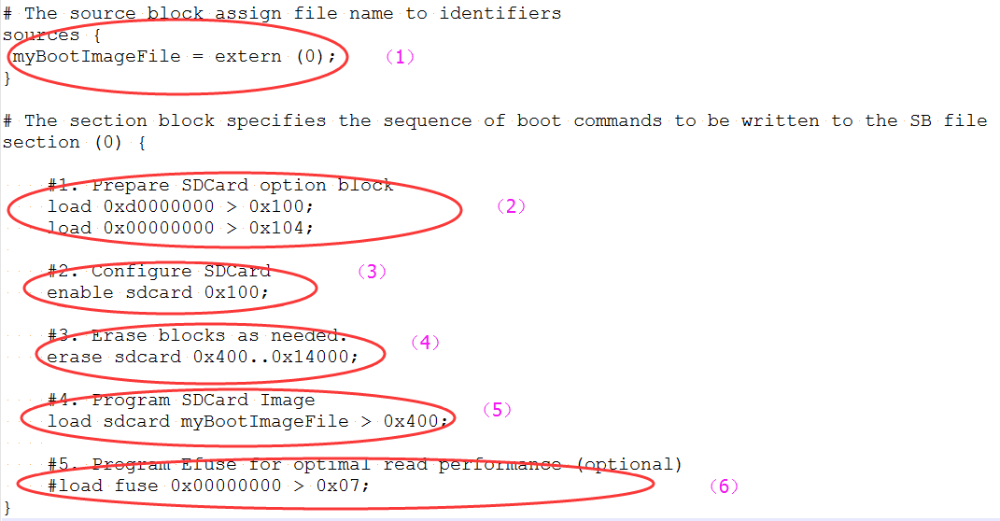

# Steps to Generate SB file for SD image programming

In general, there are six steps in the BD file to program the bootable image to SD card.

1.  The bootable image file path is provided in sources block.
2.  Prepare SDCard option block.
3.  Enable SDCard access using enable command.
4.  Erase SD card memory as needed.
5.  Program boot image binary into SD card.
6.  Program optimal SD boot parameters into Fuse \(optional, remove it if it is not required in actual project\).

An example is shown in the figure below.

**Example BD file for SD boot image programming**



The steps to generate SB file for encrypted SD boot image and KeyBlob programming is similar to FlexSPI NAND. See the example below for more details.

```
# The source block assign file name to identifiers
sources {
 myBootImageFile = extern (0);
 dekFile = extern (1);
}
# The section block specifies the sequence of boot commands to be written to the SB file
section (0) {
    #1. Prepare SDCard option block
    load 0xd0000000 > 0x100;
    load 0x00000000 > 0x104;
    #2. Configure SDCard
    enable sdcard 0x100;
    #3. Erase blocks as needed.
    erase sdcard 0x400..0x14000;
    #4. Program SDCard Image
    load sdcard myBootImageFile > 0x400;
    #5. Generate KeyBlob and program it to SD Card
    # Load DEK to RAM
    load dekFile > 0x10100;
    # Construct KeyBlob Option
    #---------------------------------------------------------------------------
    # bit [31:28] tag, fixed to 0x0b
    # bit [27:24] type, 0 - Update KeyBlob context, 1 Program Keyblob to SPI NAND
    # bit [23:20] keyblob option block size, must equal to 3 if type =0,
    #             reserved if type = 1
    # bit [19:08] Reserved
    # bit [07:04] DEK size, 0-128bit 1-192bit 2-256 bit, only applicable if type=0
    # bit [03:00] Firmware Index, only applicable if type = 1
    # if type = 0, next words indicate the address that holds dek
    #              the 3rd word
    #----------------------------------------------------------------------------
    # tag = 0x0b, type=0, block size=3, DEK size=128bit
    load 0xb0300000 > 0x10200;
    # dek address = 0x10100
    load 0x00010100 > 0x10204;
    # keyblob offset in boot image
    # Note: this is only an example bd file, the value must be replaced with actual
    #       value in users project
    load 0x00004000 > 0x10208;
    enable sdcard 0x10200;
    #6. Program KeyBlob to firmware0 region
    load 0xb1000000 > 0x10300;
    enable sdcard 0x10300;
    #7. Program Efuse for optimal read performance (optional)
    #load fuse 0x00000000 > 0x07;
}
```