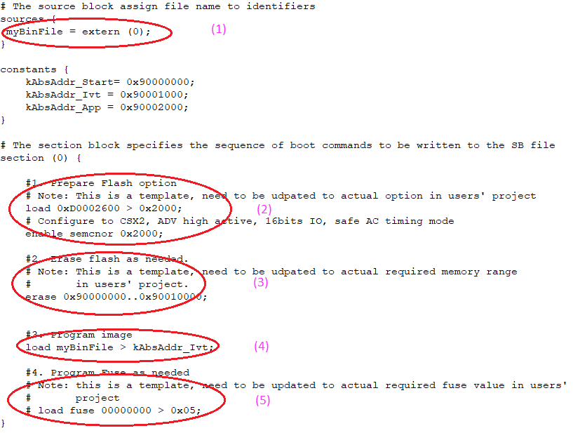

# Generate SB file for SEMC NOR image programming

In general, there are 5 steps in the BD file to program the bootable image to SD card.

1.  The bootable image file path is provided in sources block.
2.  Prepare SEMC NOR option block and SEMC NOR access using enable command.
3.  Erase SEMC NOR memory as required.
4.  Program boot image binary into SEMC NOR device.
5.  Program optimal SEMC NOR access parameters to Fuse as required.

An example BD file is shown in the figure below.

**Example BD file for SEMC NOR boot image programming**

**Parent topic:**[Generate SB file for bootable image programming](../topics/generate_sb_file_for_bootable_image_programming.md)

